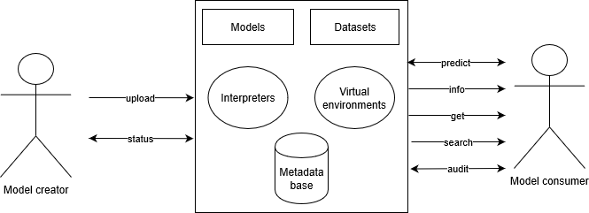

# weles

This is the Model Lake base with client packages in *Python* and *R*. **weles** supports virtualization with all versions of **Python** and **R** languages from version **3.0** and package versions.
At this moment supports all:
* scikit-learn
* keras
* mlr
* caret
* parsnip

models.

During the development **weles** is only accessible via MINI network. However you can access it from other places via ssh, if you have account at this network.



## Short description

[Short description](Description.html)

# Installation

If you just want to use **weles** as a client user, you only need to install proper client package. If you want to host the base for yourself, you need to install the base.

## Client packages

### Python

```
git clone https://github.com/ModelOriented/weles.git 
pip install weles/python
```
### R

```
devtools::install_github("ModelOriented/weles/r")
```

## Base

### Docker

```
sudo docker build . -t  weles

sudo docker run --rm -d -ti -e SECRET_KEY='KEY' -e database_password='PASSWORD' weles
```

After running your container, you have to change the urls in your client package to point your container.

### Normal installation

[Base installation](https://github.com/ModelOriented/weles/blob/master/ModelGovernance/README.md)

# Usage

## Python

[Usage in Python](https://github.com/ModelOriented/weles/blob/master/python/README.md)

## R

[Usage in R](https://github.com/ModelOriented/weles/blob/master/r/README.md)
